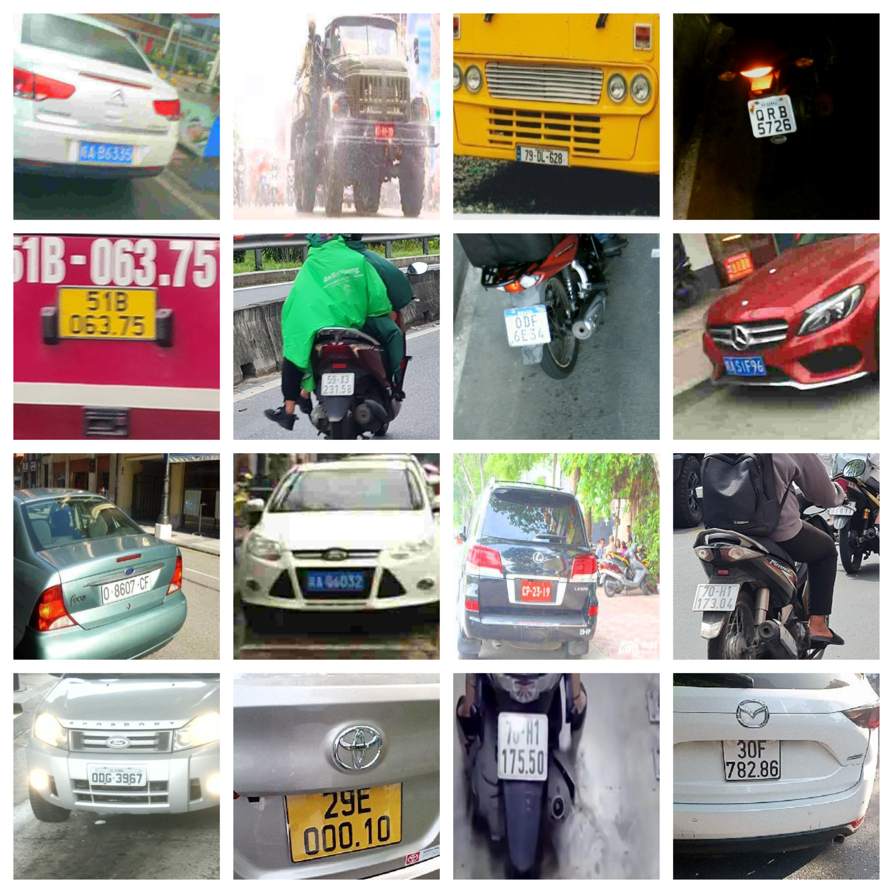

# LiteALPR: Lightweight & Accurate License Plate Recognition

[](https://pypi.org/project/litealpr/)
[](https://pypi.org/project/litealpr/)
[](https://www.gnu.org/licenses/agpl-3.0)
[](https://doi.org/10.5281/zenodo.22722292)

<p align="center">
  
  <br>
  <em>Visual samples of challenging real-world license plates (motion blur, diverse layouts, low light) handled robustly by LiteALPR.</em>
</p>

---

## What is LiteALPR?

**LiteALPR** is an open-source, lightweight, and accurate end-to-end Automatic License Plate Recognition (ALPR) framework designed for real-world production systems and resource-constrained edge environments.

Unlike conventional ALPR systems that rely on computationally expensive models or suffer severe accuracy loss on degraded images, LiteALPR introduces targeted architectural innovations:

1. **YOLOv8n-Efficient Detector**: Replaces heavy C2f blocks with lightweight C3Ghost modules, reducing parameters to **2.00M** and slashing CPU detection latency by **2.35×** without losing localization accuracy.
2. **SVTR26-Tiny Recognizer**: Replaces resource-intensive 2D attention decoders with **Height-wise Average Pooling (HAP)**, aligning with horizontal plate character layouts while reducing inference to **~5.03 ms** on GPU and **~8.32 ms** on CPU.
3. **Robust Degradation Augmentations**: Trained with synthetic motion blur and optical degradation to achieve **89.15% full-sequence accuracy** across multi-national benchmarks (Vietnam, China, Brazil).

---

## Key Highlights

- ⚡ **High Throughput**: **~66.5 FPS** on an NVIDIA RTX 3060 and **~23.4 FPS** on an AMD Ryzen 5 4600G CPU.
- 🎯 **High Accuracy**: **89.15%** sequence accuracy on challenging real-world plates, compared to only 22.67% from existing lightweight alternatives like `fast-alpr`.
- 📦 **Plug-and-Play Python API**: Simple `LiteALPR()` pipeline with automatic HuggingFace model weight caching.
- 🔄 **Flexible Backends**: Native support for **ONNX Runtime** (CPU & CUDA execution providers) as well as raw PyTorch (`.pt` / `.pth`).
- 🌐 **Cross-Regional Support**: Validated on diverse license plate formats and multi-line layouts (Brazil RodoSol-ALPR, China CBLPRD-330k, Vietnam traffic footage).

---

## Quick Example

```python
from litealpr import LiteALPR

# Initialize pipeline (auto-downloads pre-trained models from HuggingFace)
model = LiteALPR()

# Read license plate
results = model.read("sample.jpg")

for res in results:
    print(f"Plate: {res['text']} | Confidence: {res['score']:.4f} | Box: {res['box']}")
```

---

## Next Steps

- Check out [Getting Started](getting-started.md) to install LiteALPR via `pip`.
- Read about our [Pipeline & Architecture](pipeline.md) innovations.
- Explore the comprehensive [Python API & Usage](usage.md) guide.
- Learn how to train custom models in the [Training & Tools](training.md) guide.
- Review detailed [Benchmarks](benchmarks.md) on GPU & CPU platforms.
- Cite the project in your research using [Paper & Citation](citation.md).
