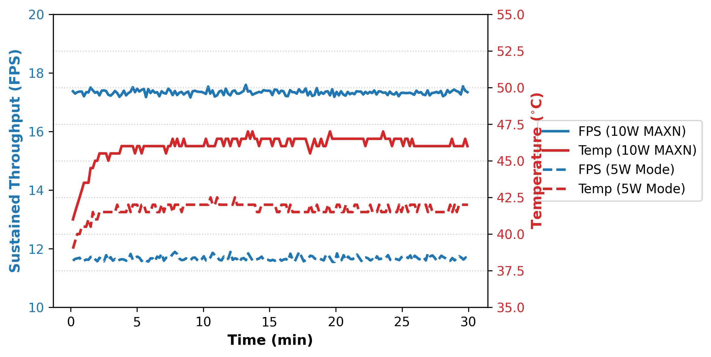

# Edge Deployment (Jetson Nano)

To demonstrate the practical viability of LiteALPR in resource-constrained edge environments, we evaluated the framework on an NVIDIA Jetson Nano utilizing TensorRT post-training quantization.

## Hardware & Software Specifications

To ensure exact reproducibility, the following specifications were used during our edge evaluation:

- **Hardware**: NVIDIA Jetson Nano Developer Kit
    - **CPU**: Quad-core ARM Cortex-A57
    - **GPU**: 128-core NVIDIA Maxwell
    - **Memory**: 4 GB 64-bit LPDDR4 (25.6 GB/s bandwidth)
    - **Power Mode**: 10W (MAXN) maximum performance mode
- **Software Environment**:
    - **OS**: Ubuntu 18.04
    - **JetPack SDK**: 4.6.1
    - **CUDA**: 10.2
    - **cuDNN**: 8.2
    - **TensorRT**: 8.2.1
    - **Python**: 3.6.9

### Latency Breakdown

!!! info "Benchmarking Methodology"
    Similar to the desktop evaluation, the Jetson Nano latency and throughput (mean ± std) were rigorously measured over **1,000 test images** across **5 consecutive execution passes** to ensure statistical reliability.

| Pipeline Component | Latency (ms) |
| :--- | :---: |
| Pre-processing | 6.59 ± 0.82 |
| Detection (YOLOv8n-Efficient FP16) | 20.66 ± 1.15 |
| Crop & Resize | 1.71 ± 0.45 |
| Recognition (SVTR26-Tiny INT8) | 21.77 ± 1.30 |
| Context-Switching | 6.73 ± 0.94 |
| Memcpy (H2D/D2H) | 0.23 ± 0.05 |
| **Total End-to-End Latency** | **57.69 ± 4.71** |
| **Sustained Throughput (FPS)** | **17.33 ± 1.45** |


To reproduce the Jetson Nano benchmark (17.33 FPS End-to-End), follow these steps:

## Step 1: Export Models to ONNX
First, export the trained PyTorch models to ONNX format (this can be done on your host machine):

```bash
# Export Detection Model
python tools/export_det.py \
    -m output/det/yolov8n_efficient/train/weights/best.pt \
    --imgsz 416 \
    --opset 12
# -> Expected output: output/det/yolov8n_efficient/train/weights/best_416.onnx

# Export Recognition Model
python tools/export_rec.py \
    -m output/rec/svtr26_tiny/train/best.pth \
    --save_path output/rec/svtr26_tiny/train/best.onnx \
    --opset 12 \
    --dynamic
# -> Expected output: output/rec/svtr26_tiny/train/best.onnx
```

## Step 2: Build TensorRT Engines
Transfer the ONNX models to your Jetson Nano and use `trtexec` to build the optimized engines. We utilize **FP16** precision for the detector and **INT8** quantization for the recognizer to maximize throughput.

> **Note on INT8 Quantization:** Applying INT8 quantization to SVTR26-Tiny drastically reduces latency (approx. 5× speedup compared to FP32's ~111.12 ms) while maintaining robust accuracy (**89.28% sequence accuracy**, **3.26% CER**). The slight accuracy improvement suggests that INT8 calibration inherently acts as a regularization mechanism, suppressing high-frequency sensor noise. For detailed performance comparisons, refer to the [Benchmarks](benchmarks.md) page.

```bash
# Build YOLOv8n-Efficient Engine (FP16)
/usr/src/tensorrt/bin/trtexec --onnx=/path/to/your/models/best_416.onnx \
    --saveEngine=yolov8n_efficient_416_fp16.engine \
    --fp16 \
    --workspace=2048

# Build SVTR26-Tiny Engine (INT8)
/usr/src/tensorrt/bin/trtexec --onnx=/path/to/your/models/best.onnx \
    --saveEngine=svtr26_tiny_int8.engine \
    --workspace=1024 \
    --minShapes=input:1x3x32x32 \
    --optShapes=input:1x3x64x64 \
    --maxShapes=input:1x3x128x128 \
    --int8
```

## Step 3: Run Full Pipeline Benchmark
Finally, execute the provided Python benchmarking script directly on the Jetson Nano. This script precisely measures the end-to-end latency, including pre-processing, context-switching, and GPU memory transfers:

```bash
python test_performance/benchmark_latency_jetson_nano.py \
  --images_dir /path/to/your/dataset/images \
  --det_model_path /path/to/your/models/yolov8n_efficient_416_fp16.engine \
  --rec_model_path /path/to/your/models/svtr26_tiny_int8.engine
```

## Step 4: Pure C++ Inference Profiling (Optional)
In production, edge pipelines are often deployed entirely in C/C++ to eliminate Python overhead (such as the Global Interpreter Lock and context switching). To benchmark the pure theoretical latency of the standalone compiled engines, you can use the `trtexec` profiling tool:

```bash
# Profile Detection Engine (YOLOv8n-Efficient)
/usr/src/tensorrt/bin/trtexec \
    --loadEngine=/path/to/your/models/yolov8n_efficient_416_fp16.engine \
    --shapes=images:1x3x416x416 \
    --iterations=1000 \
    --avgRuns=100

# Profile Recognition Engine (SVTR26-Tiny)
/usr/src/tensorrt/bin/trtexec \
    --loadEngine=/path/to/your/models/svtr26_tiny_int8.engine \
    --shapes=input:1x3x32x128 \
    --iterations=1000 \
    --avgRuns=100
```

## Step 5: System Resource Monitoring (Optional)
To monitor the system resource utilization (RAM, CPU, GPU, and Temperature) during inference, you can use the built-in `tegrastats` utility.

Open a new terminal on your Jetson Nano and run:
```bash
tegrastats
```
While `tegrastats` is running, execute the benchmark script from **Step 3** in your primary terminal. You will be able to observe the real-time resource footprint as the models are loaded into VRAM and inference begins. Maintaining a low memory footprint is critical on edge devices. For instance, loading both YOLOv8n-Efficient FP16 and SVTR26-Tiny INT8 peaks at only ~2.55 GB, well within the 4 GB limit of the Jetson Nano:

| Execution Phase | RAM Utilization | CPU Utilization | GPU Utilization | Temperature |
| :--- | :---: | :---: | :---: | :---: |
| Idle | 1,467 MB | ~3% | 0% | 25.0°C |
| Initialization | 1,742 MB | ~26% | 99% | 25.0°C |
| Peak Inference | 2,554 MB | ~35% | 40–99% | 32.0°C |
| Cooldown | 1,467 MB | ~22% | 0% | 30.5°C |

## Step 6: Power & Thermal Stress Testing (Optional)
To validate the deployment reliability for continuous 24/7 edge operation, we provide a stress testing script. This script runs the end-to-end pipeline continuously for a specified duration and logs the FPS, Latency, and Temperature every 10 seconds to a CSV file.

```bash
python test_performance/run_stress_test_jetson_nano.py \
  --images_dir /path/to/your/dataset/images \
  --det_model_path /path/to/your/models/yolov8n_efficient_416_fp16.engine \
  --rec_model_path /path/to/your/models/svtr26_tiny_int8.engine \
  --duration 30 \
  --output_csv run_stress_test_results.csv
```

This will run the pipeline continuously for 30 minutes. As an example, our rigorous 30-minute stress test demonstrates exceptional thermal stability under different power configurations. Running in the maximum performance 10W (MAXN) mode, the system sustains a throughput of 17.33 FPS with a safe Always-On (AO) peak temperature of 47.0°C. In the low-power 5W mode, the system averages 11.67 FPS with a peak temperature of 42.5°C. In both scenarios, the system exhibited zero thermal throttling, ensuring reliable continuous traffic monitoring.


