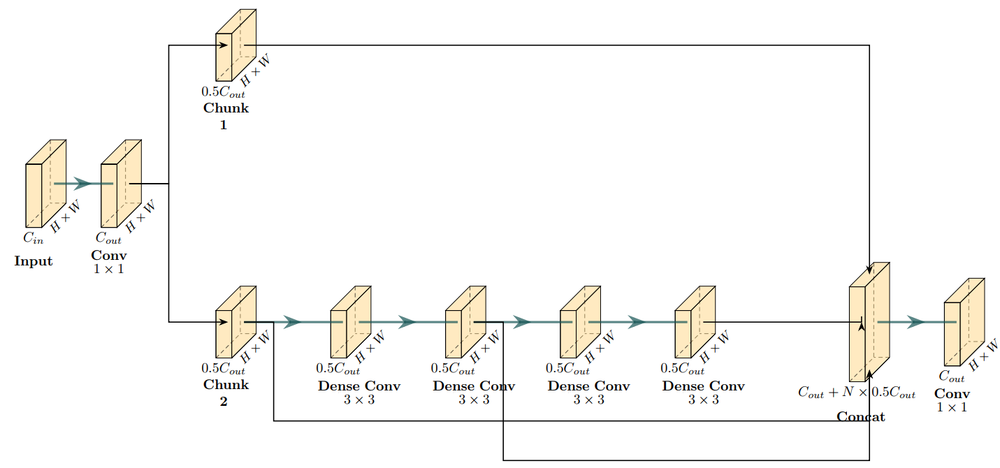
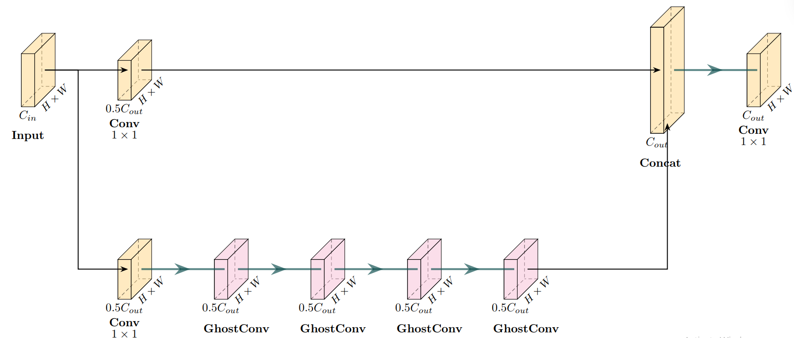
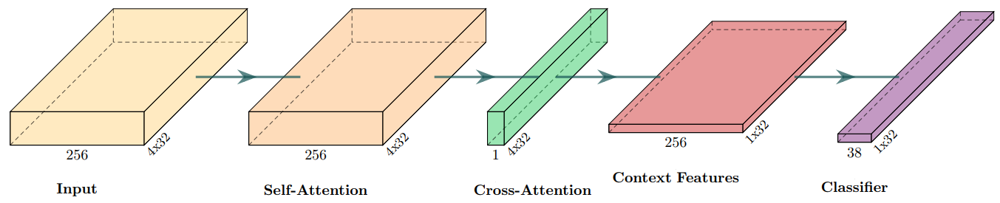
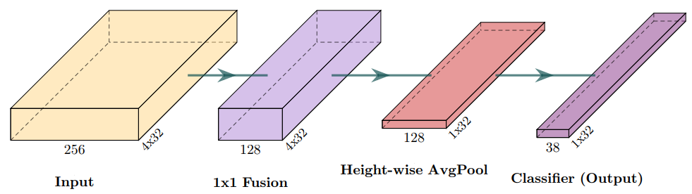

# Pipeline & Architecture

LiteALPR is built as a sequential two-stage pipeline: **Detection** followed by **Recognition**. Both stages have been engineered from the ground up to eliminate redundant computations.

  
  ➔ <b>YOLOv8n-Efficient</b> ➔
  
  ➔ <b>SVTR26-Tiny</b> ➔ <code>59P289136</code>

---

## 1. YOLOv8n-Efficient for Fast Detection

The first stage localizes the bounding box coordinates of the license plate within the full input frame.

### Ghost Convolution Formulation
In conventional YOLO architectures, the feature fusion neck relies heavily on standard **C2f** blocks containing dense convolutions. While effective for general object detection, license plates exhibit rigid rectangular geometries and simpler spatial textures, rendering dense feature maps computationally redundant.

LiteALPR substitutes dense Bottlenecks with **C3Ghost** blocks. The underlying **Ghost Convolution** breaks down standard convolution into two computationally lighter stages:

1. **Intrinsic Feature Generation**: Given input $X \in \mathbb{R}^{C \times H \times W}$, a primary standard convolution with reduced filters generates intrinsic feature maps:

    $$Y' = X * W$$

2. **Ghost Feature Generation**: Inexpensive depthwise linear operations ($\Phi$) are applied to each intrinsic channel to produce secondary "ghost" feature maps:

    $$y_{ij} = \Phi_{i,j}(y'_i), \quad \forall i = 1, \dots, m; \quad j = 1, \dots, s$$

3. **Feature Concatenation**: The intrinsic and ghost feature maps are concatenated along the channel dimension to form the final representation:

    $$Y = [Y', Y'']$$

This mathematical factorization enables Ghost Convolution to preserve representational capacity while significantly reducing FLOPs.

| Baseline: Heavy C2f Block | Proposed: Lightweight C3Ghost Block |
| :---: | :---: |
| { width="320" } | { width="320" } |

### Key Improvements
- Reduces parameter count from **3.01M** down to **2.00M** (**33.5% reduction**).
- Reduces computational complexity from **8.19 GFLOPs** down to **5.69 GFLOPs**.
- Latency on NVIDIA RTX 3060: **~9.02 ms** (down from ~10.02 ms in baseline, **1.11× faster**).
- Latency on AMD Ryzen 5 CPU: **~17.45 ms** (down from ~40.92 ms in baseline, **2.35× faster**).
- Preserves high localization precision: **99.45% $\text{mAP}_{50}$** and **88.41% $\text{mAP}_{50-95}$**.

---

## 2. SVTR26-Tiny for Lightning-Fast Recognition

The second stage reads the alphanumeric character sequence from cropped license plate images.

### Height-wise Average Pooling (HAP)
Standard text recognition architectures (e.g., TrOCR, SVTRv2 with Attention RCTC) rely on full 2D attention decoders to handle curved or arbitrary text geometries. However, vehicle license plates are strictly horizontal and rigid, making 2D attention matrices computationally wasteful.

LiteALPR introduces the **Efficient RCTC Decoder**, replacing the attention module with **Height-wise Average Pooling (HAP)**:

1. **Channel Fusion (Bottleneck)**: Compresses incoming features $X \in \mathbb{R}^{C \times H \times W}$ into $X_{\text{fused}} \in \mathbb{R}^{C' \times H \times W}$ (where $C' \ll C$, e.g., 128 channels) using a $1 \times 1$ convolution.

2. **Height-wise Average Pooling**: Averages features across the vertical dimension $H$ to project the 2D spatial map directly into a 1D sequence of length $W$:

    $$X_{\text{pool}} = \frac{1}{H}\sum_{i=1}^{H} X_{\text{fused}}[:, i, :] \quad \in \mathbb{R}^{C' \times W}$$

3. **Linear Sequence Classification**: Maps pooled features to character logits over vocabulary $V$ via CTC:

    $$P = \text{Softmax}(W_{\text{linear}} X_{\text{pool}} + b_{\text{linear}}) \quad \in \mathbb{R}^{V \times W}$$

| Original: Attention RCTC Decoder | Proposed: Efficient RCTC Decoder (HAP) |
| :---: | :---: |
| { width="350" } | { width="350" } |

### Benchmark Impact
- Model size: **4.22M parameters** (down from **5.11M** in baseline SVTRv2, **17.4% reduction**).
- Latency on NVIDIA RTX 3060: **~5.03 ms** (down from ~5.85 ms in baseline, **1.16× faster**).
- Latency on AMD Ryzen 5 CPU: **~8.32 ms** (down from ~10.84 ms in baseline, **1.30× faster**).
- Sequence Accuracy: **89.15%** with Character Error Rate (CER) of **3.28%** (compared to 88.25% accuracy and 3.56% CER in baseline).
